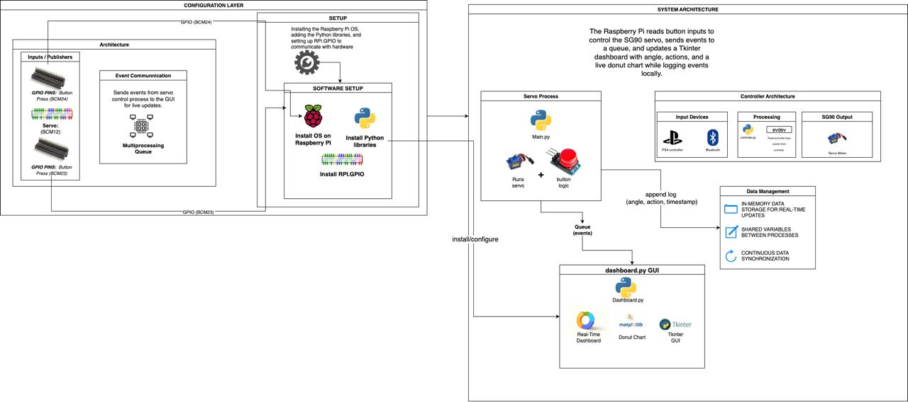

# 🧠 Servo Dashboard IoT — Raspberry Pi + PS4 Controller Integration

A real-time **IoT control system** built on Raspberry Pi that uses **physical push buttons** and a **PS4 controller** to control a **servo motor**, while a **Tkinter dashboard** visualizes button presses, rotation angles, and live statistics through a **dynamic donut chart**.

> Designed as part of an **IoT Systems** course project (IFS325), demonstrating sensor-actuator integration, multiprocessing, and event-driven architecture using Python.

---

## System Architecture



The architecture integrates three main components working in harmony:

* **Input Layer**: Physical push buttons and PS4 controller capture user commands
* **Processing Core**: Multiprocessing engine handles servo control and event routing
* **Visualization Layer**: Tkinter dashboard provides real-time system monitoring

---

## ⚙️ System Overview

This project demonstrates how a Raspberry Pi can:

* Interface with physical input devices (buttons and a PS4 controller)
* Control a servo motor in real time
* Use multiprocessing to handle hardware logic and GUI independently
* Log and visualize system activity with a live dashboard

---

## 🚀 Features

✅ Control servo motor via **two physical buttons** or **PS4 controller**  
✅ Live **Tkinter dashboard** showing current servo angle, last action, button press counters, and real-time donut chart  
✅ Event-driven multiprocessing for responsive UI  
✅ Logs actions with timestamps for performance analysis  
✅ Modular design — extendable for IoT data publishing (MQTT, Cloud)

---

## 🧰 Tech Stack

| Component     | Technology Used                                                            |
| ------------- | -------------------------------------------------------------------------- |
| Hardware      | Raspberry Pi (GPIO), SG90 Servo Motor, Push Buttons                        |
| Controller    | PS4 (DualShock 4) via `pygame`                                             |
| Language      | Python 3.10+                                                               |
| Libraries     | `gpiozero`, `pigpio`, `pygame`, `tkinter`, `matplotlib`, `multiprocessing` |
| Visualization | Tkinter GUI + Matplotlib Donut Chart                                       |
| OS            | Raspberry Pi OS (Debian-based)                                             |

---

## 📁 Directory Structure

```
servo-dashboard-iot/
├── src/
│   ├── main.py             # Runs servo + button control logic
│   ├── controller.py       # Handles PS4 controller inputs
│   └── dashboard.py        # Tkinter dashboard GUI
├── requirements.txt        # All Python dependencies
├── docs/
│   ├── system-architecture.jpg
│   └── wiring_diagram.png
├── tests/
│   └── test_basic.py
├── LICENSE
└── README.md
```

---

## 🧑‍💻 Setup Instructions

### 1️⃣ Prerequisites

* Raspberry Pi with Raspberry Pi OS
* Python 3.10 or higher
* GPIO and pigpio enabled
* Servo motor connected to GPIO18
* Buttons connected to GPIO23 (Left) and GPIO24 (Right)
* Optional: PS4 controller (via Bluetooth or USB)

---

### 2️⃣ Install Required Libraries

```bash
sudo apt update
sudo apt install python3-pip python3-tk pigpio libsdl2-2.0-0 libsdl2-image-2.0-0 libsdl2-mixer-2.0-0 libsdl2-ttf-2.0-0

git clone https://github.com/yourusername/servo-dashboard-iot.git
cd servo-dashboard-iot
pip install -r requirements.txt
```

---

### 3️⃣ Run the Application

```bash
python3 src/dashboard.py
```

This will start the Tkinter dashboard, launch the servo process, and begin listening for button and PS4 input events.

---

## 🎮 Controller Mapping (PS4)

| PS4 Button | Action          |
| ---------- | --------------- |
| X          | Rotate Left     |
| Circle     | Rotate Right    |
| Options    | Reset to Center |

Customize mappings in `controller.py`.

---

## 📊 Dashboard Components

| Component              | Description                              |
| ---------------------- | ---------------------------------------- |
| **Current Angle**      | Displays servo's present position (°)    |
| **Last Action**        | Shows the last control input received    |
| **Left/Right Presses** | Counters for each button input           |
| **Donut Chart**        | Dynamic visualization of press frequency |

---

## 🧾 Logging

Each action is logged with timestamp, action type, angle, and source to `logs/events.csv`.

---

## 🔧 Troubleshooting

| Issue             | Solution                                    |
| ----------------- | ------------------------------------------- |
| Servo not moving  | Verify GPIO18 connection; use external 5V  |
| Dashboard freezes | Check `multiprocessing.Queue` communication |
| PS4 not detected  | Run `bluetoothctl` to pair and trust device |
| Jittery servo     | Add 100–470 µF capacitor across servo pins  |
| Tkinter not found | `sudo apt install python3-tk`              |

---

## 🎥 Demo

To see the system in action:

1. Run `python3 src/dashboard.py`
2. Press physical buttons or PS4 controller buttons to control servo
3. Watch the dashboard update in real time
4. Monitor the donut chart for activity visualization

---

## 📜 License

This project is licensed under the **MIT License** — see [LICENSE](LICENSE) for details.

---

## ⭐ Acknowledgments

* University of the Western Cape — IoT Systems (IFS325)
* `gpiozero`, `pygame`, and `Tkinter` communities
* Raspberry Pi Foundation

---

**💡 Tip:** For best performance, run on Raspberry Pi 4 with active cooling and use `pigpio` for precise PWM signals if jitter occurs.
